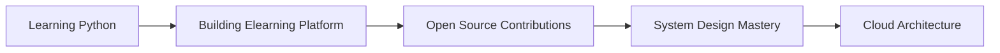

<div align="center">

# 👨‍💻 IRABARUTA WILLY NORBERT

### 🚀 Full Stack Developer | Problem Solver | Tech Enthusiast

[](http://willy-fawn.vercel.app/)
[](mailto:willynorbert53@gmail.com)
[](https://www.linkedin.com/in/i-willy-norbert-6662b034a/)
[](https://github.com/Willy-Norbert)


</div>

---

<div align="center">
    
</div>

---

## 🎯 About Me

```javascript
const willy = {
  name: "IRABARUTA WILLY NORBERT",
  role: "Full Stack Developer",
  education: "Adventist University of Central Africa (AUCA)",
  location: "Rwanda",
  currentFocus: "Elearning Platform Development",
  learning: ["Python", "Advanced React Patterns", "System Design"],
  passions: ["Clean Code", "Problem Solving", "Building Scalable Applications"],
  quote: "Code is like humor. When you have to explain it, it's bad."
};

console.log(`Welcome to ${willy.name}'s GitHub! 🚀`);
```

**I'm a passionate Full-Stack Developer** currently pursuing my studies at **Adventist University of Central Africa (AUCA)**. I specialize in building efficient, scalable web applications with a focus on clean code architecture and user experience.

### 🔥 What I'm Up To

- 🔭 **Currently Working On**: Elearning Platform - Building a comprehensive learning management system
- 🌱 **Currently Learning**: Python, Advanced React Patterns, System Design
- 💬 **Ask Me About**: JavaScript, React, Node.js, Full-Stack Development, Web Architecture
- ⚡ **Fun Fact**: I turn coffee into code ☕ → 💻
- 🎯 **2024 Goals**: Contribute to open source, master Python, build 5+ production apps

---

## 🛠️ Tech Stack & Tools

### 💻 **Languages & Frameworks**

<div align="center">


</div>

### 🗄️ **Databases & Cloud**

<div align="center">


</div>

### 🎨 **Design & Tools**

<div align="center">


</div>

---

## 🚀 Featured Projects

### 1. 🔐 **Simple Authentication System**
> A production-ready authentication system with enterprise-level security features

**Tech Stack**: `Node.js` `EJS` `PostgreSQL` `JWT` `Express.js`

**Features**:
- ✅ User Registration & Login
- ✅ JWT-based Session Management
- ✅ Password Hashing (bcrypt)
- ✅ Password Reset Functionality
- ✅ Secure Token Validation

[](https://simpleuserauthenticationsystem.onrender.com/)
[](https://github.com/Willy-Norbert)

---

### 2. 💼 **Professional Portfolio**
> A modern, responsive portfolio showcasing my journey, skills, and projects

**Tech Stack**: `HTML5` `CSS3` `JavaScript` `Bootstrap 5`

**Highlights**:
- 🎨 Modern UI/UX Design
- 📱 Fully Responsive
- ⚡ Optimized Performance
- 🌐 SEO Friendly

[](https://willynorbert.vercel.app/)

---

### 3. 💰 **Expense Tracker Web App**
> A comprehensive financial management application with real-time tracking

**Tech Stack**: `React.js` `TypeScript` `Tailwind CSS` `Context API`

**Features**:
- 📊 Expense Analytics & Visualization
- 📈 Income/Expense Tracking
- 💾 Local Storage Persistence
- 🎯 Category-based Organization
- 📱 Mobile-First Design

[](https://expense-trackerwebapps.vercel.app/)

---

## 📊 GitHub Analytics

<div align="center">
  

  

  


</div>

---

## 🏆 GitHub Achievements

<div align="center">
  
[](https://github.com/ryo-ma/github-profile-trophy)

</div>

---

## 📈 Contribution Graph

<div align="center">
  


</div>

---

## 💡 Coding Philosophy

> *"Write code as if the person who ends up maintaining your code is a violent psychopath who knows where you live."* - Martin Golding

**My Approach**:
- 🎯 **Clean Code First**: Readable, maintainable, and scalable
- 🧪 **Test-Driven**: Write tests, then code
- 📚 **Continuous Learning**: Stay updated with latest technologies
- 🤝 **Collaboration**: Code reviews and pair programming
- 🚀 **Performance**: Optimize for speed and efficiency

---

## 🎓 Education & Certifications

- 🎓 **Bachelor's Degree** - Adventist University of Central Africa (AUCA)
- 📚 **Currently Pursuing**: Advanced Full-Stack Development
- 🔥 **Self-Learning**: Python, System Design, Cloud Architecture

---

## 📬 Let's Connect!

<div align="center">
  
[](https://www.linkedin.com/in/i-willy-norbert-6662b034a/)
[](https://github.com/Willy-Norbert)
[](https://stackoverflow.com/users/22768519/norbert-willy)
[](https://x.com/IRABARUTA_100)
[](mailto:willynorbert53@gmail.com)
[](https://wa.me/+250788777888)
[](https://www.instagram.com/irabaruta_53/)
[](https://discord.com)
[](https://devcareerafrica.slack.com/)

</div>

---

## 💼 Open to Opportunities

<div align="center">
  


</div>

---

## 🎯 Current Focus



---

## 📝 Latest Blog Posts / Articles

*Coming soon... Stay tuned for technical articles and coding insights!*

---

## ⚡ Quick Stats

<div align="center">
  


</div>

---

## 🎨 Random Dev Quote

<div align="center">
  


</div>

---

<div align="center">
  
### 💬 *Feel free to reach out! I'm always open to collaborations, discussions, and new opportunities.* 🚀

**Let's build something amazing together!** ⚡


⭐️ *If you like my work, consider giving a star to my repositories!* ⭐️

</div>

---

<div align="center">
  
**Made with ❤️ by IRABARUTA WILLY NORBERT**


</div>

