<div align="center">

<!-- Animated Header with Typing Effect -->


<!-- Animated Badges -->
<p align="center">
  <a href="http://willy-fawn.vercel.app/">
    
  </a>
  <a href="mailto:willynorbert53@gmail.com">
    
  </a>
  <a href="https://www.linkedin.com/in/i-willy-norbert-6662b034a/">
    
  </a>
  <a href="https://github.com/Willy-Norbert">
    
  </a>
</p>

<!-- Animated Profile Views Counter -->
<p align="center">
  
</p>

<!-- Glowing Divider -->


</div>

---

<div align="center">
    
</div>

---

## 🎯 About Me

<!-- Innovative Animated Icons -->
<div align="center">
  


</div>

<!-- Animated Code Block with Green Terminal Theme -->
<div align="center">

```javascript
// ═══════════════════════════════════════════════════════
// 🚀 PROFESSIONAL DEVELOPER PROFILE
// ═══════════════════════════════════════════════════════

const developer = {
  name: "IRABARUTA WILLY NORBERT",
  role: "Full Stack Developer",
  education: "Adventist University of Central Africa (AUCA)",
  location: "Rwanda 🇷🇼",
  status: "🟢 Available for Opportunities",
  
  currentFocus: {
    project: "Elearning Platform Development",
    learning: ["Python", "Advanced React Patterns", "System Design"],
    goals: ["Open Source Contributions", "Cloud Architecture Mastery"]
  },
  
  expertise: {
    frontend: ["React", "TypeScript", "JavaScript", "HTML5", "CSS3"],
    backend: ["Node.js", "PHP", "Laravel", "Python"],
    database: ["MongoDB", "PostgreSQL"],
    tools: ["Git", "Figma", "VS Code", "Docker"]
  },
  
  philosophy: "Code is like humor. When you have to explain it, it's bad.",
  passion: "Building scalable, efficient, and beautiful applications"
};

console.log(`✨ Welcome to ${developer.name}'s GitHub! ✨`);
console.log(`💼 Status: ${developer.status}`);
console.log(`🎯 Current Focus: ${developer.currentFocus.project}`);
```

</div>

**I'm a passionate Full-Stack Developer** currently pursuing my studies at **Adventist University of Central Africa (AUCA)**. I specialize in building efficient, scalable web applications with a focus on clean code architecture and exceptional user experience.

### 🔥 What I'm Up To

<div align="center">

| 🎯 **Current Focus** | 📚 **Learning** | 💼 **Available** |
|:---:|:---:|:---:|
| 🟢 Elearning Platform | 🟢 Python & System Design | 🟢 Open to Opportunities |

</div>

- 🔭 **Currently Working On**: Elearning Platform - Building a comprehensive learning management system
- 🌱 **Currently Learning**: Python, Advanced React Patterns, System Design
- 💬 **Ask Me About**: JavaScript, React, Node.js, Full-Stack Development, Web Architecture
- ⚡ **Fun Fact**: I turn coffee into code ☕ → 💻
- 🎯 **2024 Goals**: Contribute to open source, master Python, build 5+ production apps

---

## 🛠️ Tech Stack & Tools

### 💻 **Languages & Frameworks**

<div align="center">

<!-- Official Logos with Hover Effects -->
<table>
<tr>
<td align="center" width="110">
  
  <br />
  <sub><b>JavaScript</b></sub>
</td>
<td align="center" width="110">
  
  <br />
  <sub><b>TypeScript</b></sub>
</td>
<td align="center" width="110">
  
  <br />
  <sub><b>Python</b></sub>
</td>
<td align="center" width="110">
  
  <br />
  <sub><b>PHP</b></sub>
</td>
<td align="center" width="110">
  
  <br />
  <sub><b>C</b></sub>
</td>
</tr>
<tr>
<td align="center" width="110">
  
  <br />
  <sub><b>React</b></sub>
</td>
<td align="center" width="110">
  
  <br />
  <sub><b>Node.js</b></sub>
</td>
<td align="center" width="110">
  
  <br />
  <sub><b>Laravel</b></sub>
</td>
<td align="center" width="110">
  
  <br />
  <sub><b>Bootstrap</b></sub>
</td>
<td align="center" width="110">
  
  <br />
  <sub><b>Tailwind</b></sub>
</td>
</tr>
</table>

</div>

### 🗄️ **Databases & Cloud**

<div align="center">

<table>
<tr>
<td align="center" width="110">
  
  <br />
  <sub><b>MongoDB</b></sub>
</td>
<td align="center" width="110">
  
  <br />
  <sub><b>PostgreSQL</b></sub>
</td>
<td align="center" width="110">
  
  <br />
  <sub><b>Vercel</b></sub>
</td>
<td align="center" width="110">
  
  <br />
  <sub><b>AWS</b></sub>
</td>
</tr>
</table>

</div>

### 🎨 **Design & Tools**

<div align="center">

<table>
<tr>
<td align="center" width="110">
  
  <br />
  <sub><b>Figma</b></sub>
</td>
<td align="center" width="110">
  
  <br />
  <sub><b>Git</b></sub>
</td>
<td align="center" width="110">
  
  <br />
  <sub><b>VS Code</b></sub>
</td>
<td align="center" width="110">
  
  <br />
  <sub><b>Docker</b></sub>
</td>
<td align="center" width="110">
  
  <br />
  <sub><b>HTML5</b></sub>
</td>
</tr>
<tr>
<td align="center" width="110">
  
  <br />
  <sub><b>CSS3</b></sub>
</td>
<td align="center" width="110">
  
  <br />
  <sub><b>Express</b></sub>
</td>
<td align="center" width="110">
  
  <br />
  <sub><b>NPM</b></sub>
</td>
<td align="center" width="110">
  
  <br />
  <sub><b>GitHub</b></sub>
</td>
<td align="center" width="110">
  
  <br />
  <sub><b>Linux</b></sub>
</td>
</tr>
</table>

</div>

### ⚡ **Innovation Icons & Technologies**

<div align="center">

<!-- Innovative Tech Icons -->
<table>
<tr>
<td align="center" width="110">
  
  <br />
  <sub><b>Next.js</b></sub>
</td>
<td align="center" width="110">
  
  <br />
  <sub><b>Redux</b></sub>
</td>
<td align="center" width="110">
  
  <br />
  <sub><b>Jest</b></sub>
</td>
<td align="center" width="110">
  
  <br />
  <sub><b>Webpack</b></sub>
</td>
<td align="center" width="110">
  
  <br />
  <sub><b>SASS</b></sub>
</td>
</tr>
</table>

<!-- Animated Tech Stack Badge -->
<p align="center">
  
  
  
</p>

</div>

---

## ⚡ Tech Stack Visualization

<div align="center">

<!-- Animated Tech Stack Display -->
<p align="center">
  
  
  
  
</p>

<!-- Tech Stack Flow -->
```
┌─────────────┐    ┌─────────────┐    ┌─────────────┐
│  Frontend   │───▶│   Backend   │───▶│  Database   │
│  React/TS   │    │  Node/PHP   │    │ MongoDB/SQL │
└─────────────┘    └─────────────┘    └─────────────┘
       │                  │                  │
       └──────────────────┴──────────────────┘
                    │
              ┌─────────┐
              │  Cloud  │
              │ Vercel  │
              └─────────┘
```

</div>

---

## 🚀 Featured Projects

<div align="center">
  


</div>

---

### 1. 🔐 **Simple Authentication System**
> A production-ready authentication system with enterprise-level security features

**Tech Stack**: 
<div align="center">
  


<span style="color: #00FF00;">JWT</span> | <span style="color: #00FF00;">EJS</span>

</div>

**Features**:
- ✅ User Registration & Login
- ✅ JWT-based Session Management
- ✅ Password Hashing (bcrypt)
- ✅ Password Reset Functionality
- ✅ Secure Token Validation

<div align="center">

[](https://simpleuserauthenticationsystem.onrender.com/)
[](https://github.com/Willy-Norbert)

</div>

---

### 2. 💼 **Professional Portfolio**
> A modern, responsive portfolio showcasing my journey, skills, and projects

**Tech Stack**: 
<div align="center">
  


</div>

**Highlights**:
- 🎨 Modern UI/UX Design
- 📱 Fully Responsive
- ⚡ Optimized Performance
- 🌐 SEO Friendly

<div align="center">

[](https://willynorbert.vercel.app/)

</div>

---

### 3. 💰 **Expense Tracker Web App**
> A comprehensive financial management application with real-time tracking

**Tech Stack**: 
<div align="center">
  


<span style="color: #00FF00;">Context API</span>

</div>

**Features**:
- 📊 Expense Analytics & Visualization
- 📈 Income/Expense Tracking
- 💾 Local Storage Persistence
- 🎯 Category-based Organization
- 📱 Mobile-First Design

<div align="center">

[](https://expense-trackerwebapps.vercel.app/)

</div>

---

## 📊 GitHub Analytics

<div align="center">
  
<!-- Green and Black Themed Stats -->

  

  


</div>

---

## 🏆 GitHub Achievements

<div align="center">
  
[](https://github.com/ryo-ma/github-profile-trophy)

</div>

---

## 📈 Contribution Graph

<div align="center">
  


</div>

---

## 💼 Professional Metrics (For Leaders & Recruiters)

<div align="center">

| 📊 **Metric** | 📈 **Value** | 🎯 **Status** |
|:---:|:---:|:---:|
| **Years of Experience** | 3+ Years | 🟢 Active |
| **Projects Completed** | 10+ Production Apps | 🟢 Growing |
| **Code Quality** | Clean & Maintainable | 🟢 Excellent |
| **Team Collaboration** | Strong Communicator | 🟢 Proven |
| **Problem Solving** | Analytical Thinker | 🟢 Skilled |
| **Learning Agility** | Continuous Learner | 🟢 Committed |

</div>

### 🎯 **Key Strengths for Leadership Teams**

- ✅ **Full-Stack Expertise**: End-to-end development capabilities
- ✅ **Modern Tech Stack**: Proficient in latest technologies
- ✅ **Production Experience**: Deployed multiple live applications
- ✅ **Security Focus**: Enterprise-level authentication systems
- ✅ **Performance Optimization**: Speed and efficiency oriented
- ✅ **Clean Architecture**: Maintainable and scalable code

---

## 💡 Coding Philosophy

<div align="center">

> *"Write code as if the person who ends up maintaining your code is a violent psychopath who knows where you live."* - Martin Golding

</div>

**My Approach**:
- 🎯 **Clean Code First**: Readable, maintainable, and scalable
- 🧪 **Test-Driven**: Write tests, then code
- 📚 **Continuous Learning**: Stay updated with latest technologies
- 🤝 **Collaboration**: Code reviews and pair programming
- 🚀 **Performance**: Optimize for speed and efficiency
- 🔒 **Security**: Security-first mindset in all projects

---

## 🎓 Education & Certifications

<div align="center">

| 🎓 **Education** | 📚 **Status** | 🔥 **Focus** |
|:---:|:---:|:---:|
| **Bachelor's Degree** - AUCA | 🟢 In Progress | Full-Stack Development |
| **Self-Learning** | 🟢 Active | Python, System Design, Cloud |

</div>

---

## 📬 Let's Connect!

<div align="center">
  
<!-- Green and Black Social Badges -->
[](https://www.linkedin.com/in/i-willy-norbert-6662b034a/)
[](https://github.com/Willy-Norbert)
[](https://stackoverflow.com/users/22768519/norbert-willy)
[](https://x.com/IRABARUTA_100)
[](mailto:willynorbert53@gmail.com)
[](https://wa.me/+250788777888)
[](https://www.instagram.com/irabaruta_53/)
[](https://discord.com)
[](https://devcareerafrica.slack.com/)

</div>

---

## 💼 Open to Opportunities

<div align="center">
  
<!-- Animated Opportunity Badges -->


</div>

---

## 🎯 Current Focus & Learning Path

```mermaid
graph LR
    A[🟢 Learning Python] --> B[🟢 Building Elearning Platform]
    B --> C[🟢 Open Source Contributions]
    C --> D[🟢 System Design Mastery]
    D --> E[🟢 Cloud Architecture]
    style A fill:#00FF00,stroke:#000000,stroke-width:3px
    style B fill:#00FF00,stroke:#000000,stroke-width:3px
    style C fill:#00FF00,stroke:#000000,stroke-width:3px
    style D fill:#00FF00,stroke:#000000,stroke-width:3px
    style E fill:#00FF00,stroke:#000000,stroke-width:3px
```



---

## ⚡ Quick Stats & Achievements

<div align="center">
  


</div>

---

## 🎨 Random Dev Quote

<div align="center">
  


</div>

---

## 🌟 Skills Breakdown

<div align="center">


</div>

<div align="center">

<table>
<tr>
<th><b>Frontend</b></th>
<th><b>Backend</b></th>
<th><b>Database</b></th>
<th><b>Tools</b></th>
</tr>
<tr>
<td align="center">
  
  <br />React
</td>
<td align="center">
  
  <br />Node.js
</td>
<td align="center">
  
  <br />MongoDB
</td>
<td align="center">
  
  <br />Git
</td>
</tr>
<tr>
<td align="center">
  
  <br />TypeScript
</td>
<td align="center">
  
  <br />Laravel
</td>
<td align="center">
  
  <br />PostgreSQL
</td>
<td align="center">
  
  <br />VS Code
</td>
</tr>
<tr>
<td align="center">
  
  <br />JavaScript
</td>
<td align="center">
  
  <br />Python
</td>
<td align="center">
  <span style="color: #00FF00;">🟢</span>
  <br />More
</td>
<td align="center">
  
  <br />Docker
</td>
</tr>
<tr>
<td align="center">
  
  <br />HTML5/CSS3
</td>
<td align="center">
  
  <br />Express.js
</td>
<td align="center">
  <span style="color: #00FF00;">🟢</span>
  <br />
</td>
<td align="center">
  
  <br />Figma
</td>
</tr>
</table>

</div>

---

## 🚀 What I Bring to Your Team

<div align="center">


</div>

<div align="center">

```diff
+ ✅ Full-Stack Development Expertise
+ ✅ Production-Ready Code Quality
+ ✅ Modern Tech Stack Proficiency
+ ✅ Security-First Mindset
+ ✅ Performance Optimization Skills
+ ✅ Team Collaboration Experience
+ ✅ Continuous Learning Attitude
+ ✅ Problem-Solving Abilities
```

</div>

### 🎯 **Development Workflow**

<div align="center">

```
🔄 Plan → 💻 Code → 🧪 Test → 🚀 Deploy → 📊 Monitor → 🔄 Iterate
   │         │         │         │          │          │
   └─────────┴─────────┴─────────┴──────────┴──────────┘
                    Continuous Improvement
```

</div>

### 🛠️ **Development Tools & Practices**

<div align="center">

<table>
<tr>
<td align="center">
  
  <br /><b>Version Control</b>
</td>
<td align="center">
  
  <br /><b>Containerization</b>
</td>
<td align="center">
  
  <br /><b>IDE</b>
</td>
<td align="center">
  
  <br /><b>Design</b>
</td>
</tr>
</table>

</div>

---

<div align="center">
  
### 💬 *Feel free to reach out! I'm always open to collaborations, discussions, and new opportunities.* 🚀

**Let's build something amazing together!** ⚡

<!-- Animated Snake -->


⭐️ *If you like my work, consider giving a star to my repositories!* ⭐️

</div>

---

<div align="center">
  
**Made with ❤️ by IRABARUTA WILLY NORBERT**


<!-- Animated Footer -->


</div>
